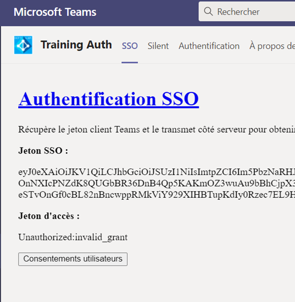
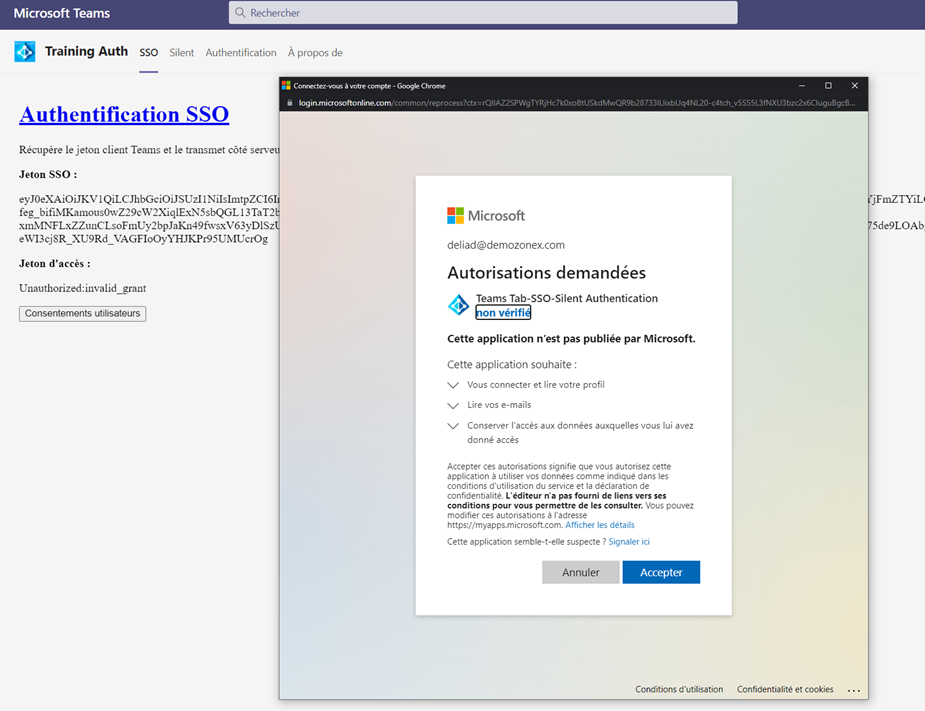
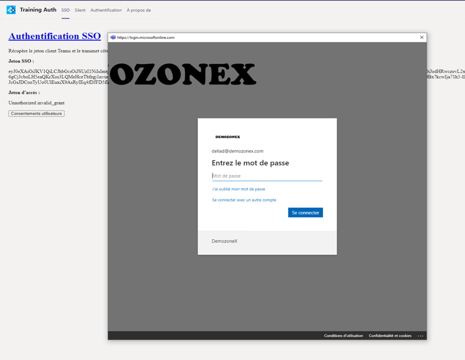
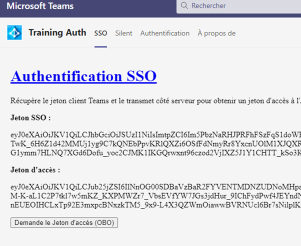

# [L'authentification SSO](https://docs.microsoft.com/fr-fr/microsoftteams/platform/tabs/how-to/authentication/auth-aad-sso)

Le single Sign-On (SSO) ou authentification unique en Français, permet à l’utilisateur de se connecter une seule fois et d’accéder aux services sans être obligé de ré-entrer ces informations d'identification.

Accéder aux services dans notre cas serait de récupèrer un jeton oauth2 d'accès, pour exécuter une requête sur [l'API Microsoft Graph](https://docs.microsoft.com/fr-fr/graph/api/overview?view=graph-rest-1.0)

Il est possible avec le [SDK Client Teams](https://docs.microsoft.com/fr-fr/javascript/api/overview/msteams-client?view=msteams-client-js-latest) d'obtenir un Jeton d'accès à l'aide la méthode **_getAuthToken()_**.

```JS
function GetTeamsToken() {
    microsoftTeams.initialize(window);
    microsoftTeams.authentication.getAuthToken({
        successCallback: resultAccessToken => {
            $('#TeamsTokens').text(resultAccessToken);
            $("#btnServerSideToken").show();
        },
        failureCallback: reason => {
            $('#Error').text(reason);                   
        }
    });
}
```

Ce jeton pourrait faire l'affaire si vous le passiez à votre propre API qui pourrait le valider et autoriser l'accès.

Néanmoins, il n'est porteur que de peut d'autorisations (email, profile, offline_access and OpenId), ce qui n'est pas suffisant lorsqu'on souhaite accéder à d'autres ressources proposées par l'API Graph par exemple.

On va donc utiliser le flux d'autorisation [on-behalf-of](https://docs.microsoft.com/fr-fr/azure/active-directory/develop/v2-oauth2-on-behalf-of-flow), afin d'obtenir; au nom de l'utilisateur authentifié sur Microsoft Teams; un jeton d'accès porteur de plus d'autorisations.

Tout d'abord il nous faut un middleware, une API Backend, qui va nous permettre :

1. De valider le Jeton obtenu par la méthode **_getAuthToken()_**, afin d'autoriser l'appelant.

>Note : Même si cela n'est pas indispensable pour mettre en place le flux on-behalf-of, c'est une bonne pratique à utiliser en terme de sécurité.

2. Une méthode qui va utiliser le flux on-behalf-of et retourner le Jeton d'accès obtenu.

Pour illustrer notre propos, nous avons deux projets séparés, l'un pour .NET et l'autre pour node.js, à vous de choisir.

>Remarque : Dans ces exemples les API Backend retournent les jetons d'accès. En conditions réels vous utiliseriez ces jetons directement dans l'API Backend afin de requêter les API Graph.

Pour .NET nous utilisons la librairie [Microsoft.Identity.Web](https://github.com/AzureAD/microsoft-identity-web) pour protéger notre API backend.

## Startup.cs

```CSharp
public void ConfigureServices(IServiceCollection services)
    {
    
    services.AddMicrosoftIdentityWebApiAuthentication(Configuration)
       .EnableTokenAcquisitionToCallDownstreamApi()
       .AddInMemoryTokenCaches();
    // Code omis pour plus de clarté
  }
```

L'API **_AddMicrosoftIdentityWebApiAuthentication(Configuration)_**, va indiquer au middleware comment valider le Jeton.

La configuration pour Azure Active Directory se trouve dans le fichier appsettings.json qui doit impérativement contenir la section **AzureAd** comme illustré ici :

```JSON
{
  "AzureAd": {
    "Instance": "https://login.microsoftonline.com/",
    "Domain": "[NOM DE DOMAINE]",
    "Audience": "[CLIENT ID]", 
    "TenantId": "[TENANT ID]", 
    "ClientId": "[CLIENT ID]", 
    "ClientSecret": "CLIENT SECRET",    
  },

```

| Paramètres| Description |
| ------------- |:-------------|
| Domain | Nom du domain Azure Active Directory |
| Audience | Dans notre exemple le client Id de l'application enregistrée sur Azure Active Directory |
| TenantId | Le tenand Id Azure Active Directory |
| ClientId | Le client Id de l'application enregistrée sur Azure Active Directory |
| ClientSecret** | Le secret de l'application enregistrée sur Azure Active Directory |

>**Il ne faut **JAMAIS** laisser de secret dans son application. Mais pour des raisons de simplicité ici je l'accepte. Néanmoins il est préférable d'utiliser des services externes pour protéger les secrets, comme des coffres forts, style Azure Keyvault.

La méthode **_.EnableTokenAcquisitionToCallDownstreamApi()_** va exposer le service **_ITokenAcquisition_** qu'il sera possible d'utiliser dans le controller **_authController.cs_**, afin d'obtenir un jeton d'accès avec le flux on-behalf-of.


## authController.cs

```CSharp
 private ITokenAcquisition _tokenAcquisition;
  public authcontroller(IConfiguration configuration, 
                        ITokenAcquisition tokenAcquisition)
  {
      Configuration = configuration;
      _tokenAcquisition = tokenAcquisition;
  }
  [HttpGet]
  [Route("token")]
  public async Task<IActionResult> Token()
  {      
      string[] scopes = new string[] { "https://graph.microsoft.com/.default" };
      string token = null;
      try
      {
          
         token= await _tokenAcquisition.GetAccessTokenForUserAsync(scopes);
      }
      catch (MicrosoftIdentityWebChallengeUserException webex)
      {
          return Unauthorized(webex.MsalUiRequiredException.ErrorCode);
      }
      return Ok(token);
  }
```

>Remarque : Vous trouverez également en commentaire dans le code C# une seconde manière d'acquerir un jeton à l'aide cette fois-ci de la librairie [MSAL.NET](https://github.com/AzureAD/microsoft-authentication-library-for-dotnet).

On injecte dans le constructeur le service **_ITokenAcquisition_** qui expose la méthode **_.GetAccessTokenForUserAsync()_** afin d'obtenir le jeton d'accès que l'on retourne à l'appellant.

Pour node.js, nous utiliserons des librairies [jsonwebtoken](https://www.npmjs.com/package/jsonwebtoken) et [jwks-rsa](https://www.npmjs.com/package/jwks-rsa) pour la validation du jeton.

## service.js

```JS
const validateJwt = (req, res, next) => {
  const authHeader = req.headers.authorization;
  if (authHeader) {
      const token = authHeader.split(' ')[1];

      const validationOptions = {
          audience: config.auth.clientId,
          issuer: config.auth.authority + "/v2.0"
      }

      jwt.verify(token, getSigningKeys, validationOptions, (err, payload) => {
          if (err) {
              console.log(err);
              return res.sendStatus(403);
          }

          next();
      });
  } else {
      res.sendStatus(401);
  }
};


const getSigningKeys = (header, callback) => {
  var client = jwksClient({
      jwksUri: 'https://login.microsoftonline.com/common/discovery/keys'
  });

  client.getSigningKey(header.kid, function (err, key) {
      var signingKey = key.publicKey || key.rsaPublicKey;
      callback(null, signingKey);
  });
}
```

Ensuite pour obtenir le jeton d'accès avec le flux on-behalf-of, nous utiliserons la librairie [MSAL.JS V2 pour node.js](https://www.npmjs.com/package/@azure/msal-node)

```JS
app.get('/token',validateJwt, (req,res) => {
  const authHeader = req.headers.authorization;
  const oboRequest = {
      oboAssertion: authHeader.split(' ')[1],
      scopes: [".default"],
  }
  cca.acquireTokenOnBehalfOf(oboRequest).then((response) => {
      console.log(response);
      res.send(response.accessToken);      
  }).catch((error) => {
      res.status(401).send(error);
  });
});
```

Configuration pour MSAL.JS

```JS
const config = {
  auth: {
      clientId: "[CLIENT ID]"
      authority: "https://login.microsoftonline.com/[TENANT ID]", 
      clientSecret: "[CLIENT SECRET]",
  }
};
```

>Encore une fois le secret ne doit **JAMAIS** être codé en dur dans le code !!!

Une fois l'API Backend mis en place, il faut l'appeler en lui passant dans son entête **_authorization_**" le jeton obtenu par la méthode **_microsoftTeams.authentication.getAuthToken()_**

## SSO.html

```JS
function GetServerSideToken() {
    $("#btnConsent").hide();
    var teamsToken = $('#TeamsTokens').text();
    $.ajax({
        url: window.location.origin.toLowerCase() + "/token",
        headers: {
            'Authorization': 'bearer ' + teamsToken
        },
        type: "get",
        success: function (result, status) {
            $('#AccessToken').text(result);            
        },
        error: function (result, status, error) {
            let resultObject=JSON.parse(result.responseText);
            $('#Error').text(error + ":" + resultObject.errorCode);                    
            if (resultObject.errorCode  === "invalid_grant" || resultObject.errorCode  === "unauthorized_client") {
                $("#btnConsent").show();
                $("#btnServerSideToken").hide();
            }
        }
    });
}
```

Si l'appel de l'API backend réussi, on affiche le jeton d'accès.

Néanmoins la 1ere fois que l'application est utilisée par l'utilisateur de Microsoft Teams, il y a de grandes chances qu'elle échoue comme illustré sur la figure suivante :



Le code d'erreur **invalid_grant** signifie que l'utilisateur doit consentir des droits à l'application.

Dans ce cas là nous allons déclencher la méthode **_MSALRequestConsent()_**

```JS
function MSALRequestConsent() {            
    microsoftTeams.authentication.authenticate({
        url: window.location.origin + "/Popup/authPopupRedirect.html",
        width: 1024,
        height: 1024,
        successCallback: (result) => {
            $('#AccessToken').text(result);
            $("#btnServerSideToken").show();
        },
        failureCallback: (reason) => {
            $('#Error').text(reason);
        }
    });
}
```

La méthode **_microsoftTeams.authentication.authenticate()_** va permettre de charger la page **_authPopupRedirect.html_** dans une **Popup**.

## authPopupRedirect.html

Lorsque la page **_authPopupRedirect_** se charge elle exécute le code suivant :

```JS
 $(document).ready(function () {
   microsoftTeams.initialize(window);
   const msalPopupConfig = {
       auth: {
           clientId: msalConfig.auth.clientId,
           authority: msalConfig.auth.authority,
           redirectUri: window.location.origin + "/Popup/authPopupRedirect.html"
       },
       cache: {
           cacheLocation: "sessionStorage", 
           storeAuthStateInCookie: false, 
       }
   };
   const msalClient = new msal.PublicClientApplication(msalPopupConfig);
   microsoftTeams.getContext((context) => {
       msalClient.handleRedirectPromise().then((tokenResponse) => {
           if (tokenResponse) {
               microsoftTeams.authentication.notifySuccess(tokenResponse);
           }
       }).catch((error) => {
           console.log(error);
           microsoftTeams.authentication.notifyFailure(error);
       });
       
       msalClient.loginRedirect({
           scopes: ["User.Read", "Mail.Read"],
           loginHint: context.loginHint
       });
   });
        });
```

C'est la méthode **_msaClient.LoginRedirect()_** qui affichera la page d'authentification et de consentement à l'utilisateur comme illustré sur l'image suivante :



>Note : Avec les clients Teams de Bureau ou Mobile, il est possible que vous ayez une page qui vous demande de vous authentifier.



Si une erreur survient, la méthode **_microsoftTeams.authentication.notifyFailure(error)_** est invoquée et renvoie l'erreur à la page **_/SSO/SSO.html_** traitée par la méthode **_failureCallback_**

 Si la demande de jeton réussie, la méthode **_microsoftTeams.authentication.notifySuccess(tokenResponse)_** est invoquée et renvoie le résultat à la page **_/SSO/SSO.html_** traité par la méthode **_successCallback_**

 Enfin, vous devriez obtenir une page comme illustré sur la figure suivante.



## Utilisation de l'application 

[Voir](./SetupTheApp.md)

## Parcourir les autres méthodes d'authentification

[Authentification dans les onglets](./Tab.md)

[Authentification en mode silencieux](./Silent.md)
