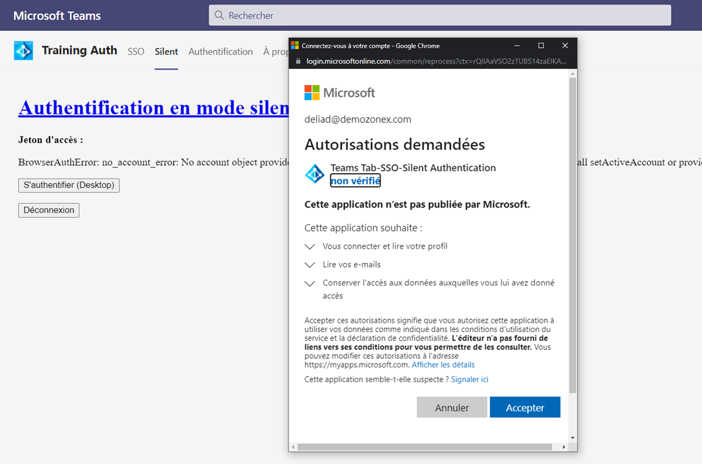
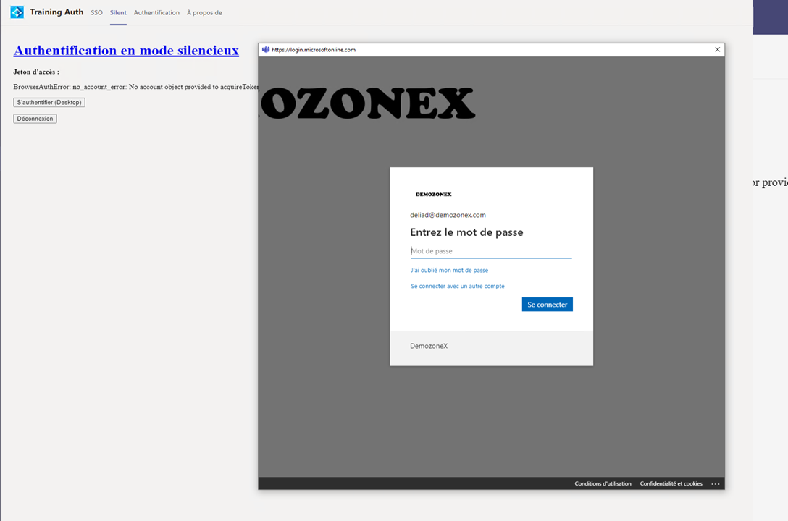
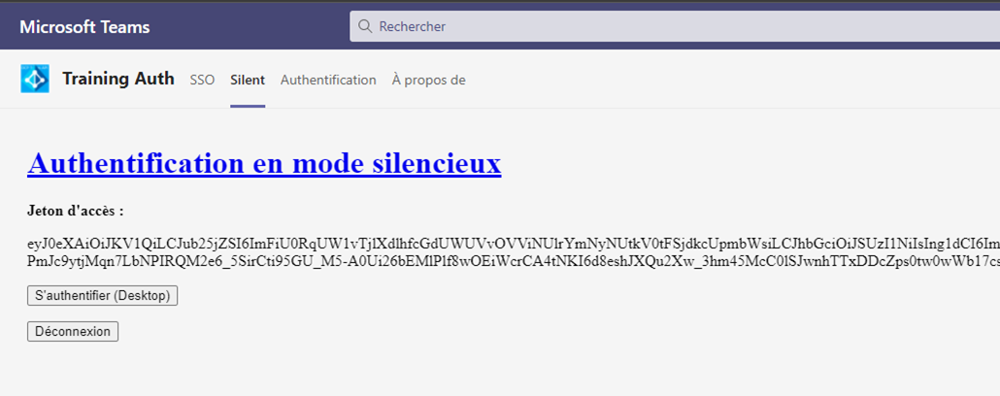

#  [L'authentification en mode silencieux](https://docs.microsoft.com/fr-fr/microsoftteams/platform/concepts/authentication/authentication)

Pour cette méthode d'authentification, nous allons essentiellement utiliser la librairie [MSAL.js v2 pour navigateur](https://github.com/AzureAD/microsoft-authentication-library-for-js/tree/dev/lib/msal-browser)

Lorsque la page **_/Silent/tabsilentauthenticationstart.html_** se charge elle déclenche la méthode **_MSALLoginPopup()_**

## tabsilentauthenticationstart.html

```JS
function MSALLoginPopup() {
    microsoftTeams.initialize(window);
    microsoftTeams.getContext(function (context) {
    var MSALApp = new msal.PublicClientApplication(msalConfig)
    
    var currentAccount = MSALApp.getAccountByUsername(context.upn);
    const silentRequest = {
        scopes: ["User.Read", "Mail.Read"],
        account: currentAccount,
        forceRefresh: false
    };
    const request = {
        scopes: ["User.Read", "Mail.Read"],
        loginHint: context.upn
    };    
    MSALApp.acquireTokenSilent(silentRequest).then(tokenResponse => {
        $('#AccessToken').text(tokenResponse.accessToken);
    }).catch(async (error) => {
        $('#Error').text(error);
        if (context.hostClientType === 'web') {
            MSALApp.acquireTokenPopup(request).then(tokenResponse => {
                $('#Error').text("");
                $('#AccessToken').text(tokenResponse.accessToken);
            });
        }
        else {      
            MSALPopupRedirect(MSALApp);
        }
    }).catch(error => {
        $('#Error').text(error);
            });

        });
    }
```

Tout d'abord on instancie la class **_msal.PublicClientApplication()_** en lui passant les paramètres Azure Active Directory définis de la manière suivante : 

```JS
const msalConfig = {
auth: {
    clientId: "[CLIENT ID]",
    authority: "https://login.microsoftonline.com/common", 
    redirectUri: window.location.origin + "/Silent/tabsilentauthenticationend.html"        
},
cache: {
    cacheLocation: "localStorage", 
    storeAuthStateInCookie: false, 
},
```
| Paramètres| Description |
| ------------- |:-------------|
|**_clientId_**| Id de l'application enregistrée sur Azure Active Directory. Pour l'inscription d'une application sur Azure Active Directory se référrer à l'article [Inscription d'une application SPA](https://docs.microsoft.com/fr-fr/azure/active-directory/develop/scenario-spa-app-registration#redirect-uri-msaljs-20-with-auth-code-flow) |
|**_authority_**|Point d'entré Azure Active Directory|
|**_redirectUri_**|Url qui sera rappelée par Azure Active Directory. Il est important que lors de l'enregistrement de l'application sur Azure Active Directory de bien la mentionner. Pour l'inscription d'une application sur Azure Active Directory se référrer à l'article [Inscription d'une application SPA](https://docs.microsoft.com/fr-fr/azure/active-directory/develop/scenario-spa-app-registration#redirect-uri-msaljs-20-with-auth-code-flow) |

Si l'utilisateur c'est déjà connecté on récupère son compte pour l'utiliser dans la demande silencieuse du Jeton

```JS
    var currentAccount = MSALApp.getAccountByUsername(context.upn)S
    const silentRequest = {
         scopes: ["User.Read", "Mail.Read"],
         account: currentAccount,
         forceRefresh: false
     };
```

Ensuite on va essayer d'obtenir un Jeton de manière silencieuse et afficher le jeton

```JS
    MSALApp.acquireTokenSilent(silentRequest).then(tokenResponse => {
                $('#AccessToken').text(tokenResponse.accessToken);
```

Si c'est la 1ere fois que l'utilisateur utilise l'application, la méthode échoue et on déclenche la méthode **_MSALApp.acquireTokenPopup()_**.

C'est alors que l'on demande à l'utilisateur de s'authentifier et d'approuver les consentements.



>Notes : Cette page de consentement, ne sera affichée qu'une seule fois. D'autre part, avec les clients Teams de Bureau ou Mobile, il est possible que vous ayez une page qui vous demande de vous authentifier.



Vous aurez noté, qu'il est possible de récupèrer le context Microsoft Teams dans lequel tourne l'application. **_microsoftTeams.getContext(function (context)_**.

L'objet context expose la propriété **_.hostClientType_** qui sera alors possible de tester pour savoir si l'application tourne dans la version Web du client Teams ou tout autre client. 

Comme la méthode **_acquiereTokenPopup()_** ne fonctionne pas "encore" sur les clients Teams de bureau et mobile, nous invoquons une autre méthode **_MSALPopupRedirect()_** pour l'authentification.

```JS
function MSALPopupRedirect(msalapp) {    
    microsoftTeams.authentication.authenticate({
        url: window.location.origin + "/Popup/authPopupRedirect.html",
        width: 1024,
        height: 1024,
        successCallback: (result) => {
            $('#Error').text("");
            $('#AccessToken').text(result.accessToken);
            
        },
        failureCallback: (reason) => {
            $('#Error').text(reason);
        }
        });
}
```

La méthode **_microsoftTeams.authentication.authenticate()_** va permettre de charger la page **_authPopupRedirect.html_** dans une **Popup**.

En fonction de la réussite ou de l'échec de l'authentification, on affiche le jeton ou l'erreur.
Lorsque la page **_authPopupRedirect_** se charge elle exécute le code suivant :

## authPopupRedirect.html

```JS
 $(document).ready(function () {
   microsoftTeams.initialize(window);
   const msalPopupConfig = {
       auth: {
           clientId: msalConfig.auth.clientId,
           authority: msalConfig.auth.authority,
           redirectUri: window.location.origin + "/Popup/authPopupRedirect.html"
       },
       cache: {
           cacheLocation: "sessionStorage", 
           storeAuthStateInCookie: false, 
       }
   };
   const msalClient = new msal.PublicClientApplication(msalPopupConfig);
   microsoftTeams.getContext((context) => {
       msalClient.handleRedirectPromise().then((tokenResponse) => {
           if (tokenResponse) {
               microsoftTeams.authentication.notifySuccess(tokenResponse);
           }
       }).catch((error) => {
           console.log(error);
           microsoftTeams.authentication.notifyFailure(error);
       });
       
       msalClient.loginRedirect({
           scopes: ["User.Read", "Mail.Read"],
           loginHint: context.loginHint
       });
   });
        });
```

Ici c'est la méthode **_msaClient.LoginRedirect()_** qui affichera la page d'authentification et de consentement à l'utilisateur.

Si une erreur survient, la méthode **_microsoftTeams.authentication.notifyFailure(error)_** est invoquée et renvoie l'erreur à la page **_/Silent/tabsilentauthenticationstart.html_** qui sera traitée par la méthode **_failureCallback_**

 Si la demande de jeton réussie, la méthode **_microsoftTeams.authentication.notifySuccess(tokenResponse)_** est invoquée et renvoie le résultat à la page **_/Silent/tabsilentauthenticationstart.html_** qui sera traité par la méthode **_successCallback_**

 >Note : Je dois encore corriger quelques bugs lors de l'utilisation de cette exemple dans les clients teams de bureau et Mobile, stay tune !!

Si l'authenfication réussie, vous devriez obtenir le jeton d'accès comme illustré sur la figure suivante : 




## Mise en place

1. Clonez le code

    git clone https://github.com/EricVernie/AuthentificationInTeams.git

2. Enregistrez l'application sur Azure Active Directory

    [Inscription d'une application à page unique](./InscriptionAAD.md/#Authentification-application-à-page-unique)

3. Ouvrez le fichier \scripts\authConfig.js et copiez l'**ID d'application (client)** obtenu à l'étape 4.1 lors de l'inscription de l'application dans le champ **clientId**
4. Modifiez le fichier manifest et déployez l'application dans Teams
    [Modification du fichier manifest](./teams.md)

[A FINIR]


## Autres méthodes d'authentification

[Le flux d'authentification dans les onglets](./Tab.md)

[L'authentification SSO](./SSO.md)

