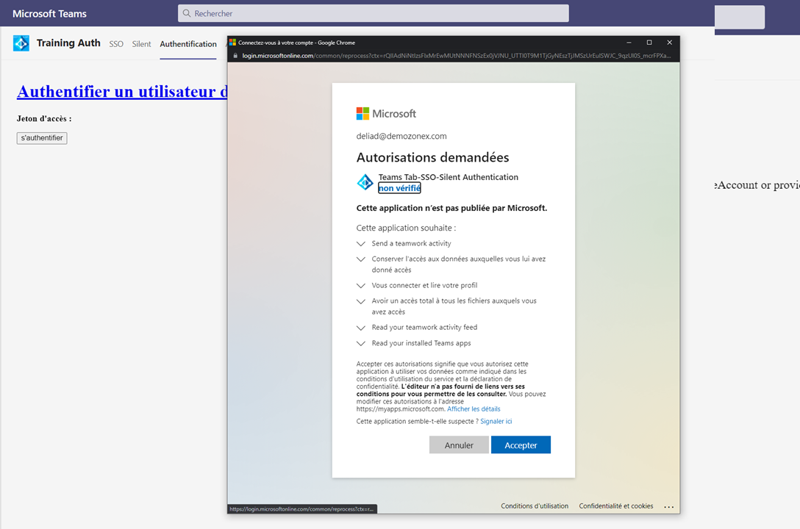

# [Authentification dans les onglets](https://docs.microsoft.com/fr-fr/microsoftteams/platform/tabs/how-to/authentication/auth-flow-tab)

Ce flux d'authentification originel, utilise des méthodes du [SDK client Teams](https://docs.microsoft.com/fr-fr/javascript/api/overview/msteams-client?view=msteams-client-js-latest), en conjonction avec les points d'entrées d'Azure Active Directory d'authentification et d'authorisation.

En d'autres termes, il se suffit à lui même, il n'utilise pas de librairie tier pour l'acquisition de jeton, mais exécute des requêtes HTTP directement sur les points d'entrées 'https://login.microsoftonline.com/common/oauth2/v2.0/authorize' et 'https://login.microsoftonline.com/common/oauth2/v2.0/token'

Vous retrouverez les exemples de code ici

    /aspnet.core
            /wwwroot
                /Tab            
    /node.js
        /public
               /Tab    

Cette authentification ce fait selon les étapes suivantes : 

1. Lorsque la page **_/tab/tabauthenticate.html_** se charge, elle déclenche la méthode **_Authenticate()_**
    
    ## tabauthenticate.html

    ```JS
    function Authenticate() {
    microsoftTeams.initialize();
    microsoftTeams.getContext((context) => {
        microsoftTeams.authentication.authenticate({
            url: window.location.origin + "/tab/tabauthenticationstart.html",
            width: 1024,
            height: 1024,
            successCallback: function (result) {
                console.log(result);
                $('#AccessToken').text(result.access_token);
            },
            failureCallback: function (reason) {
                $('#Error').text("Login failed: " + reason);
            }
        });
    });            
    ```

    La méthode **_microsoftTeams.authentication.authenticate()_** va permettre de charger la page **_tabauthenticationstart.html_** dans une **Popup**.

    En fonction de la réussite ou de l'échec de l'authentification, on affiche le jeton ou l'erreur.

2. La page **_tab/tabauthenticationstart.html_** est invoquée par le client Teams, c'est elle qui va présenter la page de consentements. 

    

    >Note : Cette page de consentements, ne sera affichée qu'une seule fois. 

    ## tabauthenticationstart.html

    ```JS
    microsoftTeams.initialize(window)
    microsoftTeams.getContext(async function (context) {
        let state = _guid(); 
        localStorage.setItem("state", state);
        var originalCode = _guid();
        var codeChallenge = await pkceChallengeFromVerifier(originalCode);
        localStorage.removeItem("codeVerifier");
        localStorage.setItem("codeVerifier", originalCode);

        var queryParams = {
            client_id: msalConfig.auth.clientId,
            response_type: "code", 
            response_mode: "fragment",
            scope: ["User.Read", "Mail.Read"],
            redirect_uri: window.location.origin.toLowerCase() + "/Tab/tabauthenticationend.html",            
            state: state,
            login_hint: context.upn,
            code_challenge: codeChallenge,
            code_challenge_method: "S256",
        };
        let params = toQueryString(queryParams);
        let authorizeEndpoint = "https://login.microsoftonline.com/common/oauth2/v2.0/authorize?" + params;
        window.location.assign(authorizeEndpoint);
    });
    ```

    En lieu et place du flux [d'authentification implicite](https://docs.microsoft.com/fr-fr/azure/active-directory/develop/v2-oauth2-implicit-grant-flow), il est **désormais préférable** d'utiliser le flux [d'authenfication par code](https://docs.microsoft.com/fr-fr/azure/active-directory/develop/v2-oauth2-auth-code-flow) pour une application à page unique (SPA).

    >_Note : les navigateurs vont sans doute à terme, bloquer l'utilisation de [cookies tiers](https://docs.microsoft.com/fr-fr/azure/active-directory/develop/reference-third-party-cookies-spas)  et comme le flux implicite ne fonctionne pas sans cookies, cela entrainera le blocage de l'application._


    La mise en place de ce flux d'authorisation par code, va s'effectuer en échangeant une clé entre la page et le fournisseur d'identité, connue sous le nom de PKCE ([Proof Key For Code Exchange](https://datatracker.ietf.org/doc/html/rfc7636)).
    
    Dans un premier temps, on crée cette clé à l'aide d'un GUID, que l'on va hasher (SHA-256) et encoder en base 64.
    
    ```JS
    var originalCode = _guid();
    var codeChallenge = await pkceChallengeFromVerifier(originalCode);    
    ```
    >Note: Vous retrouverez les méthodes _guid() et pkceChallengeFromVerifier() dans le code de la page.

    Ensuite nous allons sauvegarder le code original que nous utiliserons à l'étape 3.

    ```JS    
    localStorage.setItem("codeVerifier", originalCode);
    ```
    Enfin on va définir les paramètres de la demande d'authorisation du point d'entrée v2.0 d'Azure Active Directory https://login.microsoftonline.com/common/oauth2/v2.0/authorize

    | Paramètres| Description |
    | ------------- |:-------------|
    |**_client_id_**| Id de l'application enregistrée sur Azure Active Directory. Pour l'inscription d'une application sur Azure Active Directory se référrer à l'article [Inscription d'une application SPA](https://docs.microsoft.com/fr-fr/azure/active-directory/develop/scenario-spa-app-registration#redirect-uri-msaljs-20-with-auth-code-flow) |
    | **_response_type_** | Définie le flux d'authorization par code|
    | **_response_mode_**  | Définie comment Azure Active Directory va renvoyer le code. Ici le code sera renvoyé sous la forme d'un fragment. Nous aurons une réponse du style **/tab/tabauthenticationend.html?#code=XXXXXXXXXX**.|
    |**_scope_** | Définie les autorisations que nous souhaitons obtenir dans le Jeton.
    |**_redirect_uri_**| Url qui sera rappelée par Azure Active Directory. Il est important que lors de l'enregistrement de l'application sur Azure Active Directory de bien la mentionner. Pour l'inscription d'une application sur Azure Active Directory se référrer à l'article [Inscription d'une application SPA](https://docs.microsoft.com/fr-fr/azure/active-directory/develop/scenario-spa-app-registration#redirect-uri-msaljs-20-with-auth-code-flow) |
    |**_state_**| La valeur de cette propriété sera renvoyée telle que par Azure Active Directory, ce qui nous permettra de vérifier que c'est bien Azure Active Directory qui nous rappelle . Cela nous protège de l'exploit [CSRF](https://datatracker.ietf.org/doc/html/rfc6749#section-10.12) |
    |**_login_hint_**| Permet d'afficher dans les Popup présentées l'utilisateur authentifié sur le client Microsoft Teams. Notez ici que nous utilisons le contexte de Microsoft Teams **context** obtenu via la méthode **_getContext()_**|
    |**_code_challenge_**| Le code à echanger avec Azure Active Directory|
    |**_code_challenge_method_**| La méthode utilisée d'encodage du paramètre code_challenge|

3. Une fois authentifié, Azure Active Directory renvoi le code via la page **_/tab/tabauthenticationend.html?#code=XXXXXXX_**
      ## tabauthenticationend.html

    ```JS
    microsoftTeams.initialize()
    var hashParams = getHashParameters();        
    let expectedState = localStorage.getItem("state");

    microsoftTeams.getContext(function (context) {
        if (hashParams["error"]) {    
            microsoftTeams.authentication.notifyFailure(hashParams["error"]);
        }
        
        else if (hashParams["code"]) {
            if (expectedState !== hashParams["state"]) {                
                microsoftTeams.authentication.notifyFailure("StateDoesNotMatch");
            } else {
                
                $.ajax({
                    url: "https://login.microsoftonline.com/common/oauth2/v2.0/token",
                    type: "post",
                    data: "scope=https://graph.microsoft.com/.default"
                        + "&client_id=" + msalConfig.auth.clientId
                        + "&code=" + hashParams["code"]
                        + "&grant_type=authorization_code"
                        + "&code_verifier=" + localStorage.getItem("codeVerifier")
                        + "&redirect_uri=" + location.protocol + "//" + location.host + location.pathname,
                    contentType: "application/x-www-form-urlencoded",
                    success: function (result, status) {
                        microsoftTeams.authentication.notifySuccess(result);
                    },                    
                    error: function (result, status, error) {
                        microsoftTeams.authentication.notifyFailure(error);
                    }
                });
            }

        }
    ```

    Si une erreur survient, la méthode **_microsoftTeams.authentication.notifyFailure(error)_** est invoquée et renvoie l'erreur à la page **_/tab/tabauthenticate.html_**  (méthode **_failureCallback_**)

    Si l'authentification réussie, on va utiliser ce **code** afin d'obtenir un jeton.

    Pour obtenir ce jeton on utilise le point d'entrée https://login.microsoftonline.com/common/oauth2/v2.0/token en lui spécifiant les paramètres suivants :

    | Paramètres| Description |
    | ------------- |:-------------|
    |**_client_id_**| Id de l'application enregistrée sur Azure Active Directory. Pour l'inscription d'une application sur Azure Active Directory se référrer à l'article [Inscription d'une application SPA](https://docs.microsoft.com/fr-fr/azure/active-directory/develop/scenario-spa-app-registration#redirect-uri-msaljs-20-with-auth-code-flow) |
    |**_code_**| Le code renvoyé par Azure Active Directory lors de l'authentification|
    |**_grant_type_**| Spécifie quel flux d'authorisation nous utilisons|
    | **_code_verifier_**| Le code de vérification à utiliser, qui doit être en adéquation avec celui utilisé lors de l'authentification |

    Si la demande de jeton réussie, la méthode **_microsoftTeams.authentication.notifySuccess(result)_** est invoquée et renvoie le résultat à la page **_/tab/tabauthenticate.html_** (méthode **_successCallback_**)

    Si l'authenfication réussie, vous devriez obtenir le jeton d'accès comme illustré sur la figure suivante :

    

    >Note : Avec cette méthode d'authentification, à chaque chargement de la page, une fenêtre Popup s'affiche et se ferme automatiquement.


## Parcourir les autres méthodes d'authentification

[Authentification en mode silencieux](./Silent.md)

[Authentification SSO](./SSO.md)
